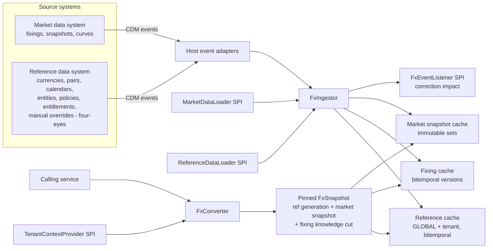

# FX Conversion Library — Functional Specification v2.0

| | |
|---|---|
| Status | Draft for technical specification generation |
| Supersedes | "FX Conversion Engine — Detailed Specification" v1 (2026-09-26) |
| Audience | Engineers and Claude Code (tech spec generation) |
| Platform | Multi-tenant SaaS CTRM/ETRM; Java 21; library embedded in-process |
| Companion specs | UOM Conversion Library v2.0, Pricing Day Resolver (PDR) Library v2.0, "Currencies in ETRM" concepts note |

---

## 0. How to read this document

- **MUST / MUST NOT / SHOULD / MAY** are normative.
- **Decisions (D-xx)** in section 2 are fixed. A technical specification MUST implement them and MUST NOT reopen them.
- **Open questions (OQ-xx)** in section 21 are unresolved. A technical specification MUST surface them, not resolve them silently.
- **Out-of-scope** items (section 1.2) are binding.
- Section 19 lists golden vectors. Values marked *ill.* are illustrative market levels; the arithmetic is binding.
- This library follows the same platform conventions as UOM v2.0 and PDR v2.0:
  - library-first;
  - reference and market data in caches fed by CDM events or SPI loaders;
  - implicit tenancy;
  - bitemporal data with four-eyes approval;
  - snapshot pinning;
  - decimal-only arithmetic;
  - neutral error codes.

---

## 1. Purpose and scope

The FX Conversion Library converts amounts and prices between currencies for a given purpose, FX policy, date context and pinned market-data snapshot. It also resolves the full currency-role chain of a trade:

**price currency → settlement currency → functional currency → presentation currency**, plus an on-read management reporting view.

It is a library embedded in-process by valuation, settlement, exposure, accounting-feed and reporting services. All market and reference data is held in in-memory caches fed by CDM events from source systems or by host-supplied `ReferenceDataLoader` / `MarketDataLoader` SPI implementations. The resolution path performs no I/O.

### 1.1 In scope

- Currency, pair-convention, fixed-factor, fixing-source and calendar reference data.
- Legal entity / accounting unit master with **effective-dated functional currency** and presentation currency.
- **Pair resolution:** identity, minor units, legal pegs, direct, inverse, triangulated.
- **Rate types:** fixings (versioned, bitemporal), spot, forward (points or CIP), interpolated forwards, averages.
- **FX date resolution** against fixing-source publication calendars and currency settlement calendars, **before** any rate lookup.
- **Averaging:** one unified model, consuming PDR pricing sets where applicable.
- **Three conversion legs and one view:** contract leg, accounting transaction leg (IAS 21 / Ind AS 21 transactional), translation leg, and management view.
- Monetary-item revaluation helper (realised and unrealised FX in functional currency).
- Correction handling, tenant source entitlements, four-eyes manual rate overrides.
- Full lineage and deterministic replay.

### 1.2 Out of scope

| Item | Owner |
|---|---|
| Market-data acquisition, cleansing, EOD sign-off workflow | Market data system (source) |
| Capture and approval of reference data and manual rate overrides | Source reference data system |
| Unit-of-measure conversion | UOM library |
| Pricing-day determination | PDR library (consumed, section 10) |
| Discounting cash flows (producing PV) | Valuation service |
| Persistence of converted values, locking of invoiced rows | Calling service (contract in section 14.4) |
| GL posting, consolidation, translation-reserve (CTA/OCI) computation | ERP / consolidation system. The library supplies translated values and rate lineage |
| Hedge accounting, FX P&L attribution, FX risk aggregation | FX Exposure / accounting systems |
| FX quanto convexity adjustments | Option pricer |
| Transport clients | Host |

---

## 2. Decisions

| ID | Decision | Resolves v1 review item |
|---|---|---|
| D-01 | Library-first. `fx-api` and `fx-core` are pure Java 21, JDK-only (ArchUnit enforced). No I/O and no system clock on the resolution path. | Platform convention |
| D-02 | FX dates are resolved against the relevant **fixing-source publication calendar** (for fixings) or **currency settlement calendars** (for value dates) **before** rate lookup. A non-publication day is moved by `nonPublicationDayHandling` (USE_PREVIOUS, USE_NEXT, SKIP_OBSERVATION, FAIL). The resulting fixing is legitimately CONFIRMED. The fallback chain applies only when a rate is missing on a valid publication day. | Blocker 1 |
| D-03 | Fixings are bitemporal versioned records (PRELIMINARY, OFFICIAL, CORRECTED, each with `recordedAt`). Spot, forward points and curves belong to immutable, versioned market snapshots. A pinned snapshot fixes both the curve set and the fixing knowledge cut, so replay is exact after any correction. | Blocker 2 |
| D-04 | Functional currency is mandatory master data per legal entity / accounting unit, effective-dated. The settlement→functional leg supports RECOGNITION_DATE, AVERAGE_RATE, CLOSING_RATE, SETTLEMENT_DATE, VALUATION_DATE and FAIR_VALUE_DATE rules. A revaluation helper computes realised and unrealised FX against a caller-supplied carrying amount. | Blocker 3 + functional currency requirement |
| D-05 | Unrealised MTM conversion requires a **present value** in the source currency and uses the valuation-date rate (spot adjusted to valuation date by default). Undiscounted future amounts are converted at the forward to their payment date, only under purpose CASH_PROJECTION. The library rejects mismatched combinations. | Blocker 4 |
| D-06 | Each policy declares a `fixingVersionPolicy`: FIRST_OFFICIAL (default for contract settlement), LATEST_CORRECTED (default for MTM and accounting), or AS_OF_KNOWLEDGE. Corrections therefore cannot change contract-settled amounts unless the contract says so. The library raises correction-impact events so hosts can find affected rows; invoiced rows are locked by the host. | Blocker 5 |
| D-07 | One averaging model: `averagingMethod` (NONE, RATE_AVERAGE, PRICE_MATCHED), with orthogonal `observationSet`, `weighting` and `outputShape`. This replaces three overlapping enums. | Blocker 6 |
| D-08 | Pricing-linked FX consumes an immutable PDR `PricingDaySet` (dates, rational weights, duplicates, sequence). Lineage records `(eventId, version, inputsHash)`. | Blocker 7 |
| D-09 | All arithmetic is decimal (`MathContext.DECIMAL128`), including interpolation, `ln` and `exp`, which use library-provided deterministic decimal algorithms. No `double`, `float`, `Math` or `StrictMath` on any calculation path. | Blocker 8 |
| D-10 | Tenant source entitlements are reference data. Source priority lists are filtered by entitlement, and derived rates inherit the most restrictive entitlement of their inputs. Results carry a distribution restriction. | Blocker 9 |
| D-11 | Manual rate overrides are reference-data records approved under four-eyes in the source system (author ≠ approver), time-boxed and reason-coded. The library accepts only approved overrides. Contract rates are trade terms, distinct from overrides. | Blocker 10 |
| D-12 | "FIXED" is removed as an overloaded term. The rate type for constants is FIXED_FACTOR. Rate finality is `rateFinality` (CONFIRMED, ESTIMATED, UNRESOLVED). A cross-spec naming table is in section 3.1. | Blocker 11 |
| D-13 | Tenant isolation is implicit via `TenantContextProvider`. GLOBAL plus TENANT overlays apply for reference data. Tenant-private market data (e.g. internal EOD rates) is TENANT-scoped. | Platform convention |
| D-14 | Every conversion request declares a `purpose`. The purpose determines allowed legs, date rules, amount types and default policies (section 9). | Structural |
| D-15 | The forward interpolation default is LOG_LINEAR_CARRY, configurable per pair. FX Exposure and other consumers MUST obtain forwards from this library rather than re-implementing interpolation. | Cross-spec consistency |
| D-16 | The management reporting view is computed on read and is never a persisted leg. Multiple presentation and reporting currencies are supported. | Review |

---

## 3. Glossary and currency roles

| Term | Definition |
|---|---|
| Price currency (PCCY) | Currency in which the commodity price or index is quoted. Renamed from v1 "trade currency". |
| Settlement currency (SCCY) | Currency of the invoice and cash movement. |
| Functional currency (FCCY) | Currency of the primary economic environment of the legal entity or accounting unit (IAS 21 / Ind AS 21 / ASC 830). Effective-dated master data. Exposure and transactional FX are measured against it. |
| Presentation currency (PRCCY) | Currency of the group or entity financial statements. Translation target. |
| Management reporting currency | Report-level display currency. On read only. |
| Accounting unit | A legal entity or foreign-operation branch that has its own functional currency. |
| Monetary item | Cash, receivables, payables, derivative balances: units of currency to be received or paid. Revalued at closing rate. |
| Non-monetary item | Inventory, prepayments, advances. Held at historical rate unless measured at fair value, in which case the rate on the fair-value date is used. |
| Fixing | An officially published rate for a source, pair, date and cut-off. Versioned. |
| Fixing source | WMR_4PM_LDN, ECB_1415_CET, BOE, RBI_REF, CFETS, BCB_PTAX, NDF fixings, INTERNAL_EOD, etc. Each has its own publication calendar. |
| Publication calendar | Dates on which a fixing source publishes. |
| Settlement calendar | Currency business days for value dates (e.g. USNY, GBLO, EUTA/TARGET). |
| Market snapshot | Immutable, versioned set of spot rates, forward points and discount curves, with a fixing knowledge cut. |
| FX date | The date whose rate is used, after calendar resolution. |
| Purpose | The business reason for a conversion (section 9). |

### 3.1 Cross-spec status naming (binding)

| Concept | Field | Values | Owning spec |
|---|---|---|---|
| Whether the rate used is final | `rateFinality` | CONFIRMED, ESTIMATED, UNRESOLVED | FX library (this) |
| Kind of rate used | `rateType` | FIXING, SPOT, FORWARD, FIXED_FACTOR, CONTRACT_RATE, MANUAL_OVERRIDE, AVERAGE | FX library (this) |
| Fixing record lifecycle | `fixingStatus` | PRELIMINARY, OFFICIAL, CORRECTED | FX library (this) |
| Contractual price→settlement conversion progress | `conversionStatus` | OPEN, PARTIALLY_CONVERTED, CONVERTED | FX Exposure |
| Pricing set status | `status` | OPEN, PROVISIONAL, FINAL | PDR |
| Price published and locked for a pricing day | (pricing engine fixing state) | — | Pricing engine |

The word FIXED MUST NOT be used as a status value in this library.

---

## 4. Architecture



### 4.1 Modules

| Module | Contents | Dependencies |
|---|---|---|
| `fx-api` | Value types, requests and results, `FxConverter`, SPIs, codes | JDK |
| `fx-core` | Date resolution, pair resolution, rate resolution, forward curves, decimal math (`ln`, `exp`), averaging, legs, precision, caches, ingestion, snapshots, entitlements | `fx-api`, JDK |
| `fx-cdm` | CDM payload mapping (no transport) | `fx-api` + CDM schema |
| `fx-testkit` | Golden vectors, conformance tests, in-memory loaders, tenant test double | all |
| `fx-guice` (optional) | Wiring | `fx-core`, Guice |

### 4.2 Runtime properties

- Pure resolution against a pinned `FxSnapshot`. No clock, no I/O.
- Single writer per tenant for ingestion, lock-free reads and atomic generation swaps.
- Determinism: same request + same pinned snapshot + same library version → bit-identical result.

---

## 5. Reference data (cached)

The version envelope is the same as UOM v2.0 section 5.1: scope GLOBAL/TENANT, `naturalKey`, `versionId`, `validFrom`/`validTo`, `recordedAt` (approval instant), APPROVED/RETIRED, `authoredBy ≠ approvedBy`, `correctionOf`, `reasonCode`. Resolution is latest assertion by `recordedAt`, with an optional knowledge pin.

| Entity | Natural key | Key fields |
|---|---|---|
| `Currency` | `code` | ISO 4217 or market minor code (GBp, USc, ZAc, ILA); `decimals`; `majorCurrency`; `settlementCalendarRef`; `deliverable`; validity (redenominations, e.g. HRK→EUR 2023-01-01, BGN→EUR 2026-01-01) |
| `PairConvention` | `base/quote` | Market convention, `pipPrecision`, `pointsScale`, `spotLag`, `spotCalendars` (joint, incl. USNY for USD crosses), `triangulationVia`, `forwardMethod` (POINTS, CIP, HYBRID), `interpolation`, `maxExtrapolationYears`, `discountCurveRefs` |
| `FixedFactor` | `(from, to)` | `factor` (exact decimal), `kind` MINOR_UNIT, LEGAL_PEG, `preferOverMarket`, validity |
| `FixingSource` | `sourceCode` | `cutoffTime`, `cutoffZone`, `publicationCalendarRef`, `pairsPublished`, `ndfTemplate?`, `usageClass` (INVOICING_ELIGIBLE, MTM_ONLY) |
| `PublicationCalendar` | `calendarRef` | Zone, coverage window, explicit publication dates |
| `SettlementCalendar` | `calendarRef` | Zone, coverage window, explicit business dates, weekend definition |
| `AccountingUnit` | `unitId` | `legalEntityId`, `functionalCurrency` (effective-dated via validity), `presentationCurrencies[]`, `parentUnitId`, `accountingPolicyRef` |
| `FxPolicy` | `policyId` | Section 8. Contract-leg policies may also arrive inline on a request (trade terms) |
| `AccountingFxPolicy` | `(unitId, purpose)` | Entity-level rules for settlement→functional and functional→presentation (sections 9.2–9.3) |
| `SourceEntitlement` | `(tenantId, sourceCode)` | `rights` ⊆ {VALUATION, DISPLAY, REDISTRIBUTION}, validity |
| `ManualRateOverride` | `(scope, pair, fxDate, sourceCode?)` | `rate`, `reasonCode`, `validFrom`/`validTo`, `authoredBy ≠ approvedBy`, `ticketRef` |

Functional currency changes apply prospectively from the change date (IAS 21.35). The library selects the functional currency valid on the conversion's accounting date. It never back-applies a change.

---

## 6. Market data (cached)

### 6.1 Fixings (bitemporal)

| Field | Notes |
|---|---|
| `sourceCode`, `pair` (market convention), `fixingDate`, `cutoff` | Natural key |
| `value` | Decimal at source precision |
| `fixingStatus` | PRELIMINARY, OFFICIAL, CORRECTED |
| `recordedAt` | Instant the version became known |
| `versionId`, `correctionOf?` | |
| `valueDate` | Spot value date of the fixing |

**Resolution for a pinned knowledge cut `k`:** among versions with `recordedAt ≤ k`, select per `fixingVersionPolicy`:

| Policy | Selected version |
|---|---|
| FIRST_OFFICIAL | The earliest OFFICIAL version |
| LATEST_CORRECTED | The latest OFFICIAL or CORRECTED version |
| AS_OF_KNOWLEDGE(t) | Latest OFFICIAL or CORRECTED with `recordedAt ≤ min(t, k)` |

If only a PRELIMINARY version exists, it is used with `rateFinality = ESTIMATED` (reason PRELIM_FIXING).

### 6.2 Market snapshots (immutable)

`marketSnapshotId` (e.g. `EOD-2026-09-25-v2`), `kind` (EOD, INTRADAY), `asOfDate`, `fixingKnowledgeCut` (instant), `signOffStatus` (SIGNED_OFF, UNSIGNED), and per pair: spot, forward points by pillar (tenor, maturity date, points or outright), plus discount curves per currency (pillars or discount factors). A correction is a new snapshot id (`-v3`). A published snapshot is never mutated.

### 6.3 Loading and retention

- **CDM events:** fixing versions, snapshot publications (a whole snapshot or chunks with a completion marker; a snapshot becomes resolvable only when complete), reference entities. Ingestion is idempotent by `versionId` / `marketSnapshotId`, and ordering and gap rules follow UOM v2.0 section 8.2.
- **`MarketDataLoader` SPI:** `loadSnapshot(id)`, `loadFixings(sourceSet, pairSet, dateRange, knowledgeCut)`, `loadChangesSince(watermark)`.
- **`ReferenceDataLoader` SPI:** as UOM v2.0.
- **Hot window:** fixings for a configurable window (default 3 years, OQ-08) and the last N snapshots are held in memory. Replay outside the window requires an explicit `prewarm(dateRange or snapshotId)`. Resolution never loads lazily; missing data → `FX_E_DATA_NOT_LOADED`.
- **Physical sharing:** GLOBAL market data is held once and shared read-only across tenants. Access is filtered per tenant entitlement (section 12).
- **Official runs** MUST pin a SIGNED_OFF snapshot. Pinning an UNSIGNED snapshot for purpose UNREALISED_MTM with `runMode = OFFICIAL` → `FX_V_UNSIGNED_SNAPSHOT`.

### 6.4 Pinning

`FxConverter.pin(marketSnapshotId)` returns an `FxSnapshot` bound to:

- the tenant;
- the current reference generation;
- the market snapshot;
- that snapshot's fixing knowledge cut (overridable with `pin(marketSnapshotId, knowledgeCut)` for audit replay).

All conversions within a run use one `FxSnapshot`.

---

## 7. Date resolution (before rate lookup)

### 7.1 Order of operations

1. Derive the raw FX date(s) from the date rule (section 8.3) and the request context (trade dates, PDR set, event dates, accounting dates).
2. Apply `offset` (business days on `offsetCalendar`, or calendar days).
3. **Calendar resolution:**
   - **For fixings:** test against the fixing source's publication calendar (or a joint calendar if the policy requires one). On a non-publication day, apply `nonPublicationDayHandling`:
     - `USE_PREVIOUS`: the previous publication day.
     - `USE_NEXT`: the next publication day.
     - `SKIP_OBSERVATION`: drop the observation; only valid inside averages, and the weights are renormalised exactly.
     - `FAIL`: `FX_E_NON_PUBLICATION_DATE`.
   - **For value dates (spot and forwards):** apply settlement calendars with `rollConvention` (FOLLOWING, MODIFIED_FOLLOWING, PRECEDING, MODIFIED_PRECEDING).
4. Record raw date → resolved date in lineage, with reason DATE_RULE_ADJUSTED.

A rate obtained on a resolved date has the same finality as any other rate on that date. **A holiday never sends a conversion to the fallback chain** (D-02).

Unplanned source non-publication (an outage on a scheduled day) is handled by the fallback chain (section 11.3), until the source system publishes a calendar version marking the day as non-publication. After that, re-resolution moves the date per step 3, and the result becomes CONFIRMED.

### 7.2 Mapping delivery days to FX dates

For daily delivery (power, gas), each delivery day maps to an FX date through `nonPublicationDayHandling`. The default is USE_PREVIOUS: weekend and holiday deliveries use the previous publication day's fixing, which is CONFIRMED.

- A gas day maps to its gas-day start date (local).
- A power delivery day maps to its local delivery date in the market's zone.

---

## 8. FX policy

### 8.1 Fields

| Field | Values / notes |
|---|---|
| `policyId`, `version` | |
| `leg` | CONTRACT, ACCOUNTING_TRANSACTION, TRANSLATION, MANAGEMENT_VIEW |
| `dateRule` | Section 8.3. Validated against leg and purpose |
| `offset`, `offsetCalendar` | ±N business or calendar days. Calendar: FIXING_SOURCE, PAIR_SETTLEMENT_JOINT, CURRENCY, CUSTOM |
| `nonPublicationDayHandling` | USE_PREVIOUS (default), USE_NEXT, SKIP_OBSERVATION, FAIL |
| `rollConvention` | For value dates. Default MODIFIED_FOLLOWING |
| `rateSourcePriority` | Ordered list. Filtered by entitlement (section 12) |
| `fixingVersionPolicy` | FIRST_OFFICIAL, LATEST_CORRECTED, AS_OF_KNOWLEDGE (section 6.1) |
| `futureDateTreatment` | FORWARD (default), SPOT |
| `spotAdjustment` | TO_VALUATION_DATE (default for UNREALISED_MTM) or NONE |
| `averaging` | Section 10 |
| `fallbackChain` | Section 11.3 |
| `allowMixedSources` | Default false |
| `forceCrossVia` | Optional currency |
| `rounding` | Section 15 |
| `contractRate` | Optional `{pair, rate, quotedIn: e.g. "GBp per USD", effectiveFrom/To, reference}`. Leg CONTRACT only |
| `estimatedEventHandling` | USE_ESTIMATE (default), FAIL |

### 8.2 Contract rate vs manual override

| | Contract rate | Manual override |
|---|---|---|
| What it is | Trade term (e.g. fixed conversion rate in a quanto or fixed-rate swap) | Substitution of a market rate (e.g. source outage) |
| Where it comes from | Trade data, approved in the trade workflow, passed in policy or request | `ManualRateOverride` reference data, four-eyes approved, loaded via CDM/SPI |
| `rateType` | CONTRACT_RATE | MANUAL_OVERRIDE |
| Leg | CONTRACT only. Never leaks into other legs | Any leg, if the policy allows overrides |
| Finality | CONFIRMED | CONFIRMED (reason MANUAL_OVERRIDE) |

### 8.3 Date rules by leg

| Rule | CONTRACT | ACCT_TXN | TRANSLATION | MGMT_VIEW | Raw FX date |
|---|---|---|---|---|---|
| TRADE_DATE | ✓ | | | | Trade date |
| SPECIFIC_DATE | ✓ | | | | Contract date |
| PRICING_SET | ✓ | | | | Observation dates of a PDR set (section 10) |
| PAYMENT_DATE | ✓ | | | | Payment date (+ offset) |
| DELIVERY_DATE | ✓ | | | | Single delivery date |
| DELIVERY_DAYS | ✓ | | | | Each delivery day (section 7.2) |
| EVENT | ✓ | | | | Event date (BL, NOR, COD, TITLE_TRANSFER, INVOICE). Source-ranked as in PDR §6.6 |
| RECOGNITION_DATE | | ✓ | | | Accounting recognition date (caller-supplied) |
| AVERAGE_RATE | | ✓ | ✓ | ✓ | All fixing days in an accounting period (IAS 21.22 practical expedient) |
| CLOSING_RATE | | ✓ | ✓ | ✓ | Last publication day of the accounting period |
| SETTLEMENT_DATE | | ✓ | | | Actual cash settlement date |
| VALUATION_DATE | | ✓ | | ✓ | Valuation date |
| FAIR_VALUE_DATE | | ✓ | | | Fair-value measurement date (non-monetary FV items) |
| HISTORICAL_RATE | | | ✓ | | Caller-supplied historical date (equity items) |

Any combination outside this table → `FX_V_INVALID_POLICY`.

---

## 9. Purposes and the conversion chain

### 9.1 Purposes

| Purpose | Legs | Amount type required | Default rules |
|---|---|---|---|
| CONTRACT_SETTLEMENT | CONTRACT | NOMINAL (undiscounted contractual amount or price) | Policy from trade; FIRST_OFFICIAL |
| UNREALISED_MTM | ACCT_TXN (VALUATION_DATE), optional TRANSLATION / MGMT_VIEW | PRESENT_VALUE | Spot adjusted to valuation date; LATEST_CORRECTED |
| CASH_PROJECTION | CONTRACT and/or ACCT_TXN | NOMINAL_FUTURE | FORWARD to payment date |
| ACCOUNTING_RECOGNITION | ACCT_TXN (RECOGNITION_DATE or AVERAGE_RATE) | NOMINAL | Entity policy |
| ACCOUNTING_REVALUATION | ACCT_TXN (CLOSING_RATE) | NOMINAL (open monetary balance) | Entity policy |
| ACCOUNTING_SETTLEMENT | ACCT_TXN (SETTLEMENT_DATE) | NOMINAL (booked settled amount) | Entity policy |
| TRANSLATION | TRANSLATION | NOMINAL (functional-currency amounts by line category) | Entity / group policy |
| MANAGEMENT_VIEW | MGMT_VIEW | Any. Labelled as view | Report policy |

Mismatches, such as UNREALISED_MTM with a NOMINAL_FUTURE amount, → `FX_V_AMOUNT_TYPE_MISMATCH` (D-05).

**Why PV × spot for MTM.** The valuation service discounts the future cash flow in its own currency. Converting that PV at the valuation-date rate equals, under covered interest parity, forward-converting the cash flow and discounting in the target currency. Converting an undiscounted amount at spot is wrong, and the library prevents it.

### 9.2 Chain legs


| Leg | Driven by | Rules | Accounting destination of differences |
|---|---|---|---|
| CONTRACT | Contract terms | Section 8.3 CONTRACT column | None. This leg defines the settlement amount |
| ACCOUNTING_TRANSACTION | Accounting unit policy | RECOGNITION_DATE / AVERAGE_RATE (initial), CLOSING_RATE (revaluation of monetary items), SETTLEMENT_DATE (realisation), VALUATION_DATE (unrealised MTM), FAIR_VALUE_DATE | P&L (transactional FX) |
| TRANSLATION | Group policy | CLOSING_RATE (assets/liabilities), AVERAGE_RATE or transaction rate (income/expense), HISTORICAL_RATE (equity) | OCI / translation reserve (computed by the consolidation system) |
| MANAGEMENT_VIEW | Report definition | Any allowed rule. Default VALUATION_DATE spot | None. Display only |

**Rules:**

- **Identity collapse:** a leg whose source and target currencies are equal after minor-unit normalisation returns identity, with zero cost. Example: EUR price, EUR settlement, EUR functional.
- The **functional currency** is resolved from `AccountingUnit` for the leg's accounting date: recognition, closing, settlement or valuation date.
- **No collapse across legs:** the library never collapses legs into a direct cross by default. Each leg reports its own rate and lineage.
- **Leg ordering:** a later leg is not computed if an earlier one is UNRESOLVED. Its result is then UNRESOLVED with reason UPSTREAM_UNRESOLVED.

**Item type on ACCOUNTING_TRANSACTION:**

| `itemType` | Treatment |
|---|---|
| MONETARY | Recognition rate initially; CLOSING_RATE at period end; SETTLEMENT_DATE on settlement |
| NON_MONETARY_HISTORICAL | Recognition rate only. Revaluation requests → `FX_V_INVALID_POLICY` |
| NON_MONETARY_FAIR_VALUE | FAIR_VALUE_DATE rate at each measurement |

### 9.3 Revaluation helper (realised and unrealised FX)

`revalue(MonetaryRevaluationRequest)` takes:

- the signed foreign amount (positive receivable, negative payable);
- the carrying functional amount (or carrying rate);
- the rule (CLOSING_RATE or SETTLEMENT_DATE);
- the accounting unit and dates.

It returns:

- the new functional amount (unrounded and booked);
- `difference = newFunctional − carryingFunctional` (signed, so payables and receivables come out correct without special cases);
- the classification: UNREALISED_FX_PNL (CLOSING_RATE) or REALISED_FX_PNL (SETTLEMENT_DATE);
- full lineage.

The library holds no carrying balances; the caller supplies them. Realised FX measured against the original recognition is the sum of the caller's prior unrealised postings and this result. The library does not compute it implicitly.

### 9.4 Leg-2 input amount

| Situation | Input to ACCOUNTING_TRANSACTION |
|---|---|
| Not yet invoiced | Unrounded settlement-currency amount (or PV for UNREALISED_MTM) |
| Invoiced or settled | Booked (rounded) settlement amount, i.e. the invoice amount |

The caller declares `settlementAmountState` (UNINVOICED, INVOICED, SETTLED). This replaces v1's keying on rate finality.

---

## 10. Averaging and PDR integration

### 10.1 Unified averaging model (D-07)

| Field | Values |
|---|---|
| `averagingMethod` | NONE (single observation); RATE_AVERAGE (average the FX rate over the FX observation set, apply to the period amount or average price); PRICE_MATCHED (convert each priced observation at its own FX date's rate) |
| `observationSet` | FROM_PRICING_SET (PDR set); FX_FIXING_DAYS_IN_WINDOW; DELIVERY_DAYS; EXPLICIT(dates) |
| `window` | Required when `observationSet ≠ FROM_PRICING_SET`: DELIVERY_PERIOD, PRICING_PERIOD, CALENDAR_MONTH, ACCOUNTING_PERIOD, CUSTOM(start, end), plus `lag` (±N publication days) |
| `weighting` | FROM_PRICING_SET (PDR rational weights), EQUAL, VOLUME, CUSTOM (rationals) |
| `outputShape` | TOTAL (single result + average rate) or SERIES (per-observation results + total) |
| `roundAverage` | Optional N dp, only if the contract fixes it |

**Mapping from v1:**

| v1 term | v2 equivalent |
|---|---|
| SINGLE_RATE | NONE + PAYMENT_DATE |
| INDEPENDENT_AVERAGE / PERIOD_AVERAGE_FX | RATE_AVERAGE |
| PRICE_MATCHED / DAILY_FX with volume weights | PRICE_MATCHED (+ SERIES for the daily shape) |

**Averaging convention:** rates are averaged in market convention for the pair, then applied, inverting if needed. Averaging inverted rates gives a different number and is not supported unless the contract demands it (`averageInverted = true`, flagged in lineage).

### 10.2 Consuming PDR sets (D-08)

- The request carries the immutable `PricingDaySet` (or its observations) together with `pdrRef = (eventId, version, inputsHash)`.
- Each observation's `observationDate` becomes a raw FX date via `fxDateFromObservation`: SAME_DATE (default) or OFFSET(n). It is then calendar-resolved (section 7).
- **Weights:** PDR rationals are used exactly. Weighted averages are computed as `Σ(p_i × X_i) / q` over a common denominator in DECIMAL128.
- **Duplicates** (ROLL_FORWARD / ROLL_BACKWARD) stay separate observations and are never collapsed.
- **Hybrid components** (different quotes and calendars) are converted per component. Component totals combine by the PDR weights.
- **PRICE_MATCHED** requires `prices[]` keyed by PDR `sequence`. A missing or extra sequence → `FX_V_PRICE_SERIES_MISMATCH`.
- **Interval observations** (future power/gas PDR strategies) map by `observationDate`.
- A new PDR version is a recompute trigger for the caller. Lineage makes stale results detectable, because `pdrRef.version` will differ from the current one.

### 10.3 Partially realised periods

Each observation is resolved independently using the rate matrix in section 11.1. The result exposes:

- `confirmedAverage`;
- `estimatedAverage`;
- `confirmedPortion` (the sum of confirmed weights, as a rational);
- the rolled-up `rateFinality`: ESTIMATED with reason PARTIAL_PERIOD until all observations are confirmed.

---

## 11. Rate resolution

### 11.1 Rate selection matrix

The FX date here is the date after calendar resolution.

| FX date vs valuation date | Fixing state at knowledge cut | Rate used | `rateFinality` (reason) |
|---|---|---|---|
| < valuation date | OFFICIAL / CORRECTED per `fixingVersionPolicy` | Fixing | CONFIRMED (FIXING) |
| < valuation date | PRELIMINARY only | Preliminary fixing | ESTIMATED (PRELIM_FIXING) |
| < valuation date | Missing on a publication day | Fallback chain (11.3) | ESTIMATED (FALLBACK_*) or UNRESOLVED (RATE_NOT_FOUND) |
| = valuation date | Published before knowledge cut | Fixing | CONFIRMED (FIXING) |
| = valuation date | Not yet published | Forward to the fixing's value date (or spot per policy) | ESTIMATED (PRE_PUBLICATION) |
| > valuation date | — | Forward per `futureDateTreatment` | ESTIMATED (FORWARD_RATE) |
| Any | Fixed factor path | Factor | CONFIRMED (FIXED_FACTOR) |
| Any | Contract rate | Contract rate | CONFIRMED (CONTRACT_RATE) |
| Any | Approved manual override applies | Override | CONFIRMED (MANUAL_OVERRIDE) |

A fallback result upgrades to CONFIRMED on recompute once the real fixing exists at a later knowledge cut. Because holidays never reach the fallback chain, every ESTIMATED fallback row is upgradeable.

### 11.2 Pair resolution

The order is unchanged from v1, with the following clarifications:

1. Identity.
2. Normalise minor units and pegs via `FixedFactor`. Fixed factors apply first and last, never mid-cross.
3. Identity again after normalisation.
4. Contract rate. Its quoting units are declared in `contractRate.quotedIn`; the library normalises them before matching.
5. Approved manual override.
6. Direct quote.
7. Inverse quote: computed by division at full precision, `inverted = true`.
8. Configured cross (`triangulationVia`).
9. Cross via USD, then EUR.
10. Otherwise `FX_E_NO_FX_PATH`.

**Rules:**

- At most one intermediate currency.
- Both legs of a cross use the same FX date, source and cut-off unless `allowMixedSources = true` (lineage then carries MIXED_SOURCE).
- Forward crosses are built per maturity: each leg is forwarded to the same value date, then crossed.
- `preferOverMarket` legal pegs (e.g. XOF) route via EUR.

### 11.3 Fallback chain (missing rate on a valid publication day only)

| Step | Behaviour | Reason |
|---|---|---|
| ALT_SOURCE | Next entitled source in priority for the same date | FALLBACK_ALT_SOURCE |
| PREVIOUS_PUBLICATION_DAY(max N) | Same source, step back up to N publication days (default 3) | FALLBACK_STALE |
| TRIANGULATE | Cross from available legs of the same source and date | FALLBACK_TRIANGULATED |
| INTERPOLATE_FIXINGS | Linear between surrounding fixings. Forbidden for CONTRACT_SETTLEMENT and accounting purposes | FALLBACK_INTERPOLATED |
| FAIL | — | RATE_NOT_FOUND → UNRESOLVED |

### 11.4 Forward construction and interpolation (decimal only, D-09)

- **Method POINTS:** `F = S + P / pointsScale`.
- **Method CIP:** `F = S × DF_base / DF_quote`.
- **Method HYBRID:** points to the last pillar, then CIP anchored at that pillar.
- **Short end:** `F(T+1) = S − TN/pointsScale`; `F(T+0) = S − (ON + TN)/pointsScale`. This is used for `spotAdjustment = TO_VALUATION_DATE`.
- **Time:** ACT/365F as an exact rational (days / 365) from the spot date to the value date.
- **Interpolation:**
  - LOG_LINEAR_CARRY (default): linear in ln(F/S) against time;
  - LINEAR_POINTS;
  - MONOTONE_CUBIC_POINTS (Hyman-filtered).

  All are computed in DECIMAL128 using the library's deterministic decimal `ln` and `exp`, accurate to at least 1e-30 relative and identical on every JVM.
- **Extrapolation:**
  - before the first pillar: from spot (zero carry);
  - after the last pillar: flat implied carry up to `maxExtrapolationYears` (default 2Y);
  - beyond that: CIP if discount curves exist, otherwise `FX_E_EXTRAPOLATION_LIMIT`.
- The method is recorded in lineage. Consumers (FX Exposure included) obtain forwards only through this library (D-15).

### 11.5 Sources, cut-offs and NDFs

- `usageClass = MTM_ONLY` sources (e.g. INTERNAL_EOD) are rejected for CONTRACT_SETTLEMENT and ACCOUNTING_SETTLEMENT (`FX_V_SOURCE_NOT_ALLOWED`).
- Non-deliverable currencies require an NDF template fixing source for settlement purposes.
- Onshore and offshore distinctions (CNY/CNH, INR onshore RBI vs offshore NDF) are modelled per OQ-05.

---

## 12. Tenancy and source entitlements

- The tenant comes from `TenantContextProvider`. No public method takes a tenant parameter. No context → `FX_E_NO_TENANT_CONTEXT`.
- Tenant `t` sees GLOBAL ∪ TENANT(t) reference data. TENANT versions outrank GLOBAL at the same key. Tenant-private market data (e.g. INTERNAL_EOD) is TENANT-scoped and invisible to other tenants.
- **Entitlement filter (D-10):** before rate lookup, `rateSourcePriority` is filtered to sources with VALUATION rights for the tenant on the FX date. Skipped sources produce `FX_W_SOURCE_SKIPPED_NOT_ENTITLED`. If no entitled source remains (and no entitled fallback) → `FX_E_SOURCE_NOT_ENTITLED`.
- **Derived rates** (crosses, forwards, averages) carry the intersection of their inputs' rights. Results expose `distributionRestriction` (e.g. `DISPLAY_ALLOWED=false`) so host UIs and reports can enforce licence terms. The library does not enforce display rules itself.
- Snapshots, memo entries and listener notifications are tenant-bound. Cross-tenant memo reuse is forbidden.

---

## 13. Corrections and invoiced amounts (D-06)

1. Contract-leg policies default to FIRST_OFFICIAL. A corrected fixing published after the first official one does **not** change a contract-settled conversion unless the contract opts in (LATEST_CORRECTED or AS_OF_KNOWLEDGE).
2. When a CORRECTED fixing is ingested, the library calls `FxEventListener.onFixingCorrected(source, pair, date, oldVersion, newVersion)`. Hosts use this to find persisted rows whose lineage references the old version.
3. `assessCorrectionImpact(previousResultLineage, newSnapshot)` recomputes and returns the difference, without the caller having to overwrite anything. Hosts decide what to do.
4. **Host contract (normative for consumers):** persisted rows with `settlementAmountState ∈ {INVOICED, SETTLED}` MUST be locked. They change only through an explicit restatement process with authorisation. The library never assumes it may rewrite them.

---

## 14. Public API, SPIs and result contract

### 14.1 API (indicative)

```
interface FxConverter {
  FxSnapshot pin(String marketSnapshotId);
  FxSnapshot pin(String marketSnapshotId, Instant knowledgeCut);
  void prewarm(PrewarmRequest r);                       // explicit, outside resolution path

  RateResult         rate(RateRequest r);
  ConversionResult   convert(ConversionRequest r);       // single amount or price, one leg
  SeriesResult       convertSeries(SeriesRequest r);     // averaging / PDR-linked
  ChainResult        convertChain(ChainRequest r);       // CONTRACT → ACCT_TXN → TRANSLATION (+ view)
  RevaluationResult  revalue(MonetaryRevaluationRequest r);
  CorrectionImpact   assessCorrectionImpact(Lineage previous, FxSnapshot current);
  List<Result<?>>    batch(List<Request<?>> rs);         // per-item results, shared rate memo
}

// SPIs
interface TenantContextProvider { Optional<String> currentTenant(); }
interface ReferenceDataLoader   { /* as UOM v2.0 */ }
interface MarketDataLoader      { /* section 6.3 */ }
interface FxEventListener       { void onFixingCorrected(...); void onRejected(...); void onSnapshotAvailable(...); }
interface FxMetrics             { /* counters/timers */ }
interface FxIngestor            { IngestOutcome apply(List<Record> records); }
```

Business failures return as results (with `orThrow()`). Batches never fail as a whole.

### 14.2 Request context (common)

| Field | Req | Notes |
|---|---|---|
| `purpose` | Y | Section 9.1 |
| `valuationDate` | Y | Never defaulted |
| `snapshot` | Y* | Pinned `FxSnapshot`. *Required for official runs; otherwise pinned implicitly to the latest available snapshot |
| `accountingUnitId` | Cond. | Required for ACCT_TXN, TRANSLATION, MGMT_VIEW |
| `amountType` | Y | NOMINAL, NOMINAL_FUTURE, PRESENT_VALUE |
| `settlementAmountState` | Cond. | UNINVOICED, INVOICED, SETTLED (section 9.4) |
| `tradeDates` | Per rule | tradeDate, paymentDate, deliveryStart/End, deliveryDays[] (with volumes) |
| `events` | Per rule | eventType → `{date, source rank, evidenceRef?}` |
| `accountingDates` | Per rule | recognitionDate, periodStart/End, settlementDate, fairValueDate, historicalDate |
| `pricingSet` | Per rule | PDR set + `pdrRef` |
| `prices[]` | PRICE_MATCHED | Keyed by PDR sequence |
| `policy` / `policyId` | Y | Inline (trade terms) or cached |
| `requestId` | Y | Correlation, copied into lineage |

### 14.3 Result and lineage (per leg)

| Field | Notes |
|---|---|
| `fromAmount`, `fromCcy`, `toCcy` | |
| `toAmountUnrounded`, `toAmountBooked` | Section 15 |
| `effectiveRate` | DECIMAL128. Reproduces the unrounded amount to 34 significant digits. Informational for series |
| `rateFinality`, `reasons[]` | Section 11.1 |
| `path[]` | `{pair, rateType, value, inverted, source, cutoff, rawDate, resolvedDate, valueDate, fixingVersionId?, fixingStatus?, interpolation?, pillars?}` |
| `observations[]` | Per-observation detail for series |
| `confirmedPortion` | Rational, for averages |
| `functionalCurrency`, `accountingUnitId` | For ACCT_TXN and later legs |
| `pdrRef` | If PDR-linked |
| `marketSnapshotId`, `fixingKnowledgeCut`, `referenceGeneration` | Pinned snapshot |
| `calendarVersions` | Map of calendarRef → versionId (publication and settlement calendars used) |
| `policyId`, `policyVersion`, `libraryVersion`, `inputsHash` | SHA-256 over the RFC 8785 canonical request + snapshot identifiers + library version |
| `distributionRestriction` | Section 12 |
| `warnings[]`, `error?` | |

### 14.4 Persistence guidance for consumers (non-normative for the library)

Persist the per-leg result, including the lineage fields above, `purpose`, and the lock state (`settlementAmountState`). EOD processing SHOULD recompute only rows that are ESTIMATED, UNRESOLVED, or MTM-purpose. CONFIRMED contract-leg rows change only via section 13.

---

## 15. Precision and rounding

- **Arithmetic:** DECIMAL128 everywhere. Multiply before dividing; compute inverses and crosses by division at full precision. Operation order is fixed so results are bit-identical across services.
- **Stored precision:** market quotes as published; derived rates at full DECIMAL128; fixed factors exact.
- **Amounts:**
  - `toAmountUnrounded` is full precision;
  - `toAmountBooked` is rounded once, to the target currency decimals (HALF_UP default, HALF_EVEN configurable per policy).
- **Price conversions** are rounded only if the contract specifies unit-price rounding (`roundUnitPrice`).
- **Rate rounding** happens only when contractual (`roundRate = N`), and is recorded in lineage.
- **Series:**
  - aggregate at full precision and round the total;
  - per-line booked amounts are allocated from the rounded total by largest remainder (ties to earliest sequence);
  - any residual against independently converted totals is returned explicitly.
- **Reconciliation tolerance** for consumers: `max(0.5 × 10^−d × lines, 1e−9 × |amount|)`.

---

## 16. Validation (ingest)

| Code | Condition |
|---|---|
| `FX_I_APPROVAL_INVALID` | Reference record or manual override without approval, or approver = author |
| `FX_I_SCOPE_VIOLATION` | Tenant/GLOBAL mismatch with channel; tenant record shadowing GLOBAL where not allowed |
| `FX_I_SNAPSHOT_IMMUTABLE` | Attempt to change a published snapshot id |
| `FX_I_SNAPSHOT_INCOMPLETE` | Snapshot chunks missing at completion marker |
| `FX_I_FIXING_SEQUENCE` | CORRECTED without a prior OFFICIAL for the key, or regression in `recordedAt` |
| `FX_I_OVERLAP` | Overlapping validity at the same `recordedAt` |
| `FX_I_INVALID_VALUE` | Non-positive rate or factor, malformed decimal |
| `FX_I_SEQUENCE_GAP` | Gap; key marked STALE and repaired via loader |

---

## 17. Resolution error and warning codes

| Code | Meaning |
|---|---|
| `FX_E_NO_TENANT_CONTEXT`, `FX_E_TENANT_MISMATCH`, `FX_E_TENANT_NOT_READY` | Tenancy |
| `FX_E_DATA_NOT_LOADED` | Required fixing or snapshot outside the hot window and not prewarmed |
| `FX_E_NO_FX_PATH` | No route |
| `FX_E_RATE_NOT_FOUND` | Fallback exhausted → UNRESOLVED |
| `FX_E_NON_PUBLICATION_DATE` | `nonPublicationDayHandling = FAIL` |
| `FX_E_EXTRAPOLATION_LIMIT` | Beyond curve and extrapolation |
| `FX_E_SOURCE_NOT_ENTITLED` | No entitled source |
| `FX_E_INACTIVE_CURRENCY` | Currency outside validity |
| `FX_E_FUNCTIONAL_CCY_NOT_FOUND` | Accounting unit has no functional currency for the date |
| `FX_E_MISSING_EVENT_DATE` | EVENT rule without a usable event date |
| `FX_V_INVALID_POLICY` | Rule/leg/purpose/item-type combination invalid (8.3, 9) |
| `FX_V_AMOUNT_TYPE_MISMATCH` | Purpose vs amount type (9.1) |
| `FX_V_PRICE_SERIES_MISMATCH` | PRICE_MATCHED prices don't match PDR sequences |
| `FX_V_SOURCE_NOT_ALLOWED` | MTM-only source used for a settlement purpose |
| `FX_V_UNSIGNED_SNAPSHOT` | Official MTM run on an unsigned snapshot |
| `FX_W_SOURCE_SKIPPED_NOT_ENTITLED` | Source skipped |
| `FX_W_MIXED_SOURCE` | Mixed sources allowed and used |
| `FX_W_DATE_RULE_ADJUSTED` | Raw date moved by calendar resolution |
| `FX_W_FALLBACK_USED` | Any fallback step |
| `FX_W_EXTRAPOLATED` | Extrapolation applied |
| `FX_W_STALE_KEY` | Key awaiting gap repair |

---

## 18. Non-functional requirements

| Area | Target (placeholders to confirm) |
|---|---|
| Single convert, warm, curve cached | p99 ≤ 20 µs |
| Forward curve build per pair per snapshot | ≤ 1 ms, built once, cached immutably per snapshot |
| Batch | 1M conversions, 60 pairs ≤ 5 s on one 8-core node (distinct rates resolved once per snapshot) |
| Memory | ≤ 50 MB per snapshot (200 pairs × 20 pillars); fixings hot window sized per OQ-08 |
| Determinism | Bit-identical across hosts, JVMs and restarts for the same request + pinned snapshot + library version |
| Ingest | Fixing event applied ≤ 10 ms p99; snapshot available ≤ 2 s after completion marker for 200 pairs |
| Concurrency | Lock-free reads; single writer per tenant; atomic swaps |
| Packaging | Semantic versioning; library version in lineage |

---

## 19. Golden test vectors

### 19.1 Arithmetic

| # | Scenario | Expected |
|---|---|---|
| G01 | EUR/JPY from EUR/USD 1.0850 and USD/JPY 149.20 (ill.) | 161.882 |
| G02 | GBP/AUD from GBP/USD 1.2700 and AUD/USD 0.6600 (ill.) | 1.924242424… |
| G03 | NBP 85.50 GBp/therm → INR via GBP/USD 1.2700, USD/INR 83.40 (ill.) | 0.855 GBP → 1.08585 USD → 90.559890 INR/therm; effective GBp→INR 1.05918 |
| G04 | EUR/USD forward, spot 1.0850, 3M (92 d) +35.0, 6M (183 d) +68.0, target 120 d, LINEAR_POINTS | 45.153846… points → 1.0895154 |
| G05 | Same, LOG_LINEAR_CARRY (decimal ln/exp) | 1.0895143 (identical digits on every run and JVM) |
| G06 | Partial period: 22 days, weights 1/22; 10 confirmed average 1.0840; 12 forwards average 1.0872 | 1.0857454545…; `confirmedPortion` = 5/11; ESTIMATED (PARTIAL_PERIOD) |
| G07 | PDR set 5 obs (1/5 each); prices USD 80, 81, 82, 83, 84; EUR/USD 1.10, 1.08, 1.12, 1.10, 1.05 (ill.); USD→EUR PRICE_MATCHED | 75.279220779 EUR/bbl |
| G08 | Same, RATE_AVERAGE (average rate 1.09) | 75.229357798 EUR/bbl. Difference vs G07 = 0.049862981 |
| G09 | BGN → EUR legacy trade dated 2026-03-01 | Fixed factor 1.95583 (LEGAL_PEG), CONFIRMED (FIXED_FACTOR) |

### 19.2 Calendar resolution (D-02)

| # | Scenario | Expected |
|---|---|---|
| C01 | ECB fixing, raw FX date Fri 3-Apr-26 (Good Friday, no publication), USE_PREVIOUS | Resolved Thu 2-Apr-26; CONFIRMED (FIXING); warning DATE_RULE_ADJUSTED. Fallback chain not invoked |
| C02 | Same, USE_NEXT | Resolved Tue 7-Apr-26 (skips Easter Monday 6-Apr); CONFIRMED |
| C03 | Same, FAIL | `FX_E_NON_PUBLICATION_DATE` |
| C04 | WMR not published on a scheduled publication day (outage); policy [WMR, ECB] | ECB used; ESTIMATED (FALLBACK_ALT_SOURCE). Recompute after WMR publishes → CONFIRMED |
| C05 | Daily gas delivery Sat 7-Nov-26, USE_PREVIOUS | FX date Fri 6-Nov-26; CONFIRMED |

### 19.3 Chain and functional currency (D-04, D-05)

TTF gas, 10,000 MWh at 35.00 EUR/MWh, settled USD, UK accounting unit (functional GBP), group presentation EUR. All rates are illustrative.

| # | Leg / purpose | Rate | Result |
|---|---|---|---|
| F01 | CONTRACT, PAYMENT_DATE fixing EUR/USD 1.0850 | 1.0850 | 379,750.00 USD |
| F02 | ACCT_TXN, RECOGNITION_DATE, GBP/USD 1.2700 (inverted) | 1/1.2700 | 299,015.75 GBP |
| F03 | ACCT_TXN revaluation, CLOSING_RATE GBP/USD 1.2500; carrying 299,015.75 | 1/1.2500 | 303,800.00 GBP; difference +4,784.25 UNREALISED_FX_PNL |
| F04 | ACCT_TXN settlement, SETTLEMENT_DATE GBP/USD 1.2600; carrying 303,800.00 | 1/1.2600 | 301,388.89 GBP; difference −2,411.11 REALISED_FX_PNL |
| F05 | TRANSLATION of revenue 299,015.75 GBP at AVERAGE_RATE EUR per GBP 1.1700 | 1.1700 | 349,848.43 EUR |
| F06 | UNREALISED_MTM, PV 379,000.00 USD (PRESENT_VALUE), valuation-date GBP/USD 1.2500 | 1/1.2500 | 303,200.00 GBP |
| F07 | UNREALISED_MTM with an undiscounted USD amount (NOMINAL_FUTURE) | — | `FX_V_AMOUNT_TYPE_MISMATCH` |
| F08 | Accounting unit functional INR until 2026-12-31 and USD from 2027-01-01; recognition 2027-01-05 | — | Functional currency USD used |
| F09 | NON_MONETARY_HISTORICAL item with CLOSING_RATE revaluation | — | `FX_V_INVALID_POLICY` |

### 19.4 Corrections, entitlements, overrides, determinism

| # | Scenario | Expected |
|---|---|---|
| X01 | ECB 2-Apr: OFFICIAL 1.0800 recorded 2-Apr 14:20; CORRECTED 1.0810 recorded 3-Apr (ill.). Contract leg, FIRST_OFFICIAL, snapshot after the correction | 1.0800 used; contract amount unchanged |
| X02 | Same fixing, MTM policy LATEST_CORRECTED, snapshot knowledge cut 2-Apr 18:00 | 1.0800 |
| X03 | Same, snapshot knowledge cut 3-Apr 18:00 | 1.0810; `onFixingCorrected` was raised at ingest |
| X04 | Replay of X02 by pinning the original snapshot after the correction exists | Bit-identical to X02 |
| X05 | Tenant without WMR rights, policy [WMR, ECB] | ECB used; `FX_W_SOURCE_SKIPPED_NOT_ENTITLED` |
| X06 | Same tenant, policy [WMR] only, no fallback | `FX_E_SOURCE_NOT_ENTITLED` |
| X07 | Manual override event with author = approver | Rejected `FX_I_APPROVAL_INVALID` |
| X08 | Approved override for USD/INR on a date with a missing RBI fixing | `rateType` MANUAL_OVERRIDE; CONFIRMED (MANUAL_OVERRIDE) |
| X09 | INTERNAL_EOD source in a CONTRACT_SETTLEMENT policy | `FX_V_SOURCE_NOT_ALLOWED` |
| X10 | G05 computed on two different JVM vendors | Identical 34-digit results |
| X11 | PRICE_MATCHED with prices for sequences 1–4 against a 5-observation PDR set | `FX_V_PRICE_SERIES_MISMATCH` |

---

## 20. Testing requirements

- All golden vectors in section 19.
- **Property tests:**
  - A→B→A within 1e-28 relative;
  - cross(A,B) × cross(B,C) = cross(A,C) at the same observation;
  - forwards converge to spot as t→0;
  - Σ series booked lines = rounded total;
  - weights from PDR sets consumed exactly.
- **Calendar edge cases:** source holidays vs currency holidays, Good Friday / Easter Monday, US-only and UK-only holidays, T+1 pairs, redenomination dates (HRK 2023-01-01, BGN 2026-01-01).
- **Policy matrix:** every rule × leg × purpose × item type, and every disallowed combination.
- **Bitemporal:** fixing versions under each `fixingVersionPolicy`; snapshot immutability; replay after correction.
- **Tenancy and entitlements:** isolation and restriction propagation through crosses and forwards.
- **Determinism:** decimal `ln`/`exp` conformance against high-precision reference values; no `double`/`float`/`Math`/`StrictMath` in `fx-core` (ArchUnit or bytecode scan).
- **Parallel run:** a full month-end against the legacy FX logic before cut-over. Breaks > 0.01 % are investigated individually.

---

## 21. Open questions

| ID | Question |
|---|---|
| OQ-01 | Firm-wide default source for ACCT_TXN and MGMT_VIEW legs: WMR 4pm or INTERNAL_EOD (MTM only)? |
| OQ-02 | Per accounting unit: AVERAGE_RATE (IAS 21.22) or actual transaction rates for P&L recognition? Configurable, but defaults are needed |
| OQ-03 | Contract template audit: which contracts use PRICE_MATCHED vs RATE_AVERAGE vs NONE+PAYMENT_DATE, and which opt into LATEST_CORRECTED |
| OQ-04 | Discount curves for CIP forwards: OIS or firm funding curves, and which source owns them |
| OQ-05 | Onshore vs offshore: separate currency codes (CNY/CNH) vs source-level distinction (INR RBI vs NDF) |
| OQ-06 | Default `spotAdjustment` for MTM: TO_VALUATION_DATE (proposed) vs NONE |
| OQ-07 | Maximum fallback staleness before an EOD sign-off is blocked |
| OQ-08 | Fixing hot-window length and number of snapshots retained in memory |
| OQ-09 | Ownership and change approval of FX policies, accounting FX policies, calendars and entitlements (Finance, Risk, Ops) |
| OQ-10 | Is `revalue` sufficient for the accounting feed, or does the ERP require additional fields (e.g. GL account hints)? |
| OQ-11 | Translation: does any consumer need line-category batch translation from this library, or does the consolidation system own it entirely? |
